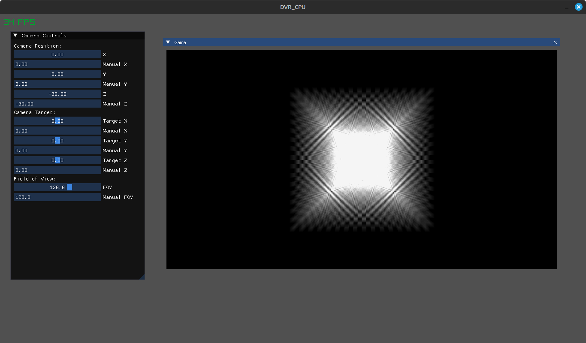
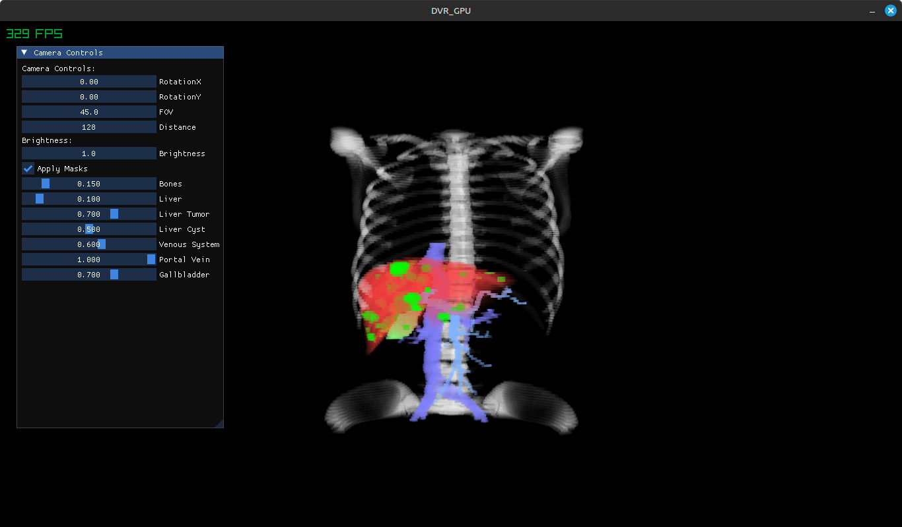

# Direct Volume Rendering

This project explores the use of Direct Volume Rendering (DVR) with ray-casting for medical imaging. We begin with a CPU
implementation and then optimize by transitioning to GPU-based computation using OpenGL. To further improve performance, a
3D Digital Differential Analyzer (DDA) algorithm is employed to enhance the ray traversal efficiency. The focus is on improving
both the rendering quality and speed when visualizing large 3D medical datasets, such as those from CT and MRI scans. <br>
TODO: [Link to article here]

## Features
- CPU-based rendering with OpenMP for basic volume rendering tasks. 
- GPU-based rendering with OpenGL compute shaders for faster rendering.
- ImGUI: A graphical user interface library used for interactive controls such as adjusting camera and mask settings in real-time.
- raylib: A simple and easy-to-use library used for managing the window, rendering the 3D scene, and handling input.

## Compilation

Requires [CMake](https://cmake.org/getting-started/) and a C++ compiler.

Clone the repo then run:

```shell
cmake . -B build
cmake --build build
```

## Usage

#### CPU

```shell
./build/bin/DVR_CPU
```

With the program running, press the <kbd>F9</kbd> key to bring up the debug
interface, or use <kbd>F9</kbd> again to close it. <br>
Use ImGUI's buttons and sliders to adjust the camera settings and other parameters.

#### GPU

Requires an Nvidia GPU supporting programmable compute shaders (GTX 600+)

```shell
__NV_PRIME_RENDER_OFFLOAD=1 __GLX_VENDOR_LIBRARY_NAME=nvidia ./build/bin/DVR_GPU
```

With the program running, press the <kbd>F</kbd> key to toggle fullscreen mode. <br>
Use ImGUI's buttons and sliders to adjust the camera and mask settings.


## Examples


Here are some examples of the Direct Volume Rendering (DVR) in action. These images showcase different rendering modes and the results from using the CPU and GPU implementations.

#### 1. CPU-Based Rendering (With OpenMP)

This image shows the result of using the CPU-based rendering method, where performance is lacking even with a small volume and a checkerboard pattern.



#### 2. GPU-Based Rendering (OpenGL Compute Shaders)

These images show the result of using the GPU-based rendering method, which is significantly faster, particularly for rendering larger datasets at native resolution (No approximation).


